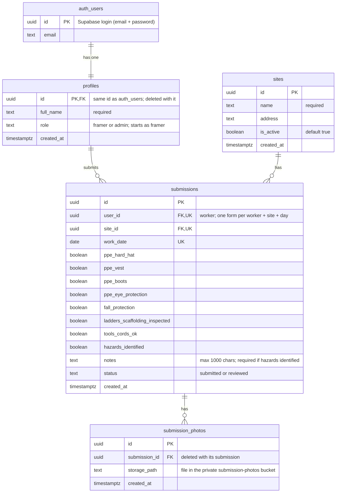

# RAS Safety

Daily site safety forms for Ron Anderson & Sons (RAS) crews. Before starting work, each framer fills in a short checklist with photos on their phone. Supervisors (admins) see every submission on a dashboard, with filters, photos and a summary of who has and hasn't submitted today.

## Deployed app

**https://ras-iota-snowy.vercel.app** (hosted on Vercel, built from the `main` branch).

## Test credentials

| Role | Email | Password | Lands on |
|---|---|---|---|
| Admin | `admin@example.com` | `RasAdmin2026!` | Dashboard |
| Framer | `jasdeep.sandhu@example.com` | `RasFramer2026!` | New form |

The other test framers use the same password: `tyler.morrison@example.com`, `megan.chu@example.com`, `ryan.fraser@example.com` and `daniel.nguyen@example.com`.

## Tech stack

- **Next.js 16** (App Router, TypeScript) with **Tailwind CSS**: the web app, hosted on **Vercel**.
- **Supabase**: Postgres database, email + password login, private photo storage, and Row Level Security (the database itself decides who can see which rows).
- **Recharts** for the one bar chart on the dashboard, and **Resend** for the optional email to the admin about each new form.
- No component library and no ORM: plain Tailwind classes and small, commented files. `docs/CODE_WALKTHROUGH.md` explains how it all fits together.

## Local setup

You need Node.js 22 or newer (the Supabase client library requires it) and a free [Supabase](https://supabase.com) project.

1. Get the code:
   ```bash
   git clone https://github.com/PuneetGrewal/ras.git
   cd ras
   npm install
   ```
2. Set up the database. In Supabase, open **SQL Editor**, paste the whole of `supabase/schema.sql`, click **Run**, then confirm the warning that appears (it only means old security rules get replaced). It creates the tables, security rules and photo storage, and is safe to run again. Then go to **Authentication → Sign In / Providers** and turn off **Allow new users to sign up** (the app has no sign-up page).
3. Copy `.env.example` to `.env.local` and fill in the three values from **Project Settings → API Keys** (the comments in the file say which is which). The secret key is used only by the seed script.
4. Create the test logins, sites and sample forms: `npm run seed`. To give some sample forms photos, first put a few JPEG/PNG/WebP site photos in `scripts/seed-photos/`. The seed is safe to run again.
5. Start the app with `npm run dev` and open http://localhost:3000.
   To try it on a phone on the same Wi-Fi, run `npm run dev -- -H 0.0.0.0` and open `http://<your computer's local IP>:3000` on the phone.

Before committing, `npm run lint` and `npm run build` must both pass.

## Deployment

1. Push the repo to GitHub.
2. In Vercel, choose **Add New → Project**, import the repo and add exactly two environment variables (values from your `.env.local`):
   - `NEXT_PUBLIC_SUPABASE_URL`
   - `NEXT_PUBLIC_SUPABASE_PUBLISHABLE_KEY`

   Do **not** add the secret key: it skips every security rule and the deployed app never uses it. Click **Deploy**.
3. In Supabase, go to **Authentication → URL Configuration** and set **Site URL** to the Vercel address, so any link in a Supabase email points at the real site.
4. Every push to `main` redeploys automatically.

### Optional: email the admin about each new form

After each successful submission, the app emails the admin the worker, site, date, whether hazards were identified, and a link to the form. If the email fails, the form is still saved; the problem is only logged.

1. Create a free account at [resend.com](https://resend.com) and make an API key (**API Keys → Create API key**, "Sending access" is enough).
2. In Vercel (**Settings → Environment Variables**) add `RESEND_API_KEY`, `ADMIN_NOTIFICATION_EMAIL` and `NEXT_PUBLIC_APP_URL` (the Vercel address). Then redeploy (**Deployments → … → Redeploy**), because `NEXT_PUBLIC_` values are built into the app. For local testing put the same three in `.env.local`, with `NEXT_PUBLIC_APP_URL=http://localhost:3000`.
3. **Without a verified domain, Resend only delivers to the Resend account owner's own address**, sent from `onboarding@resend.dev`. So `ADMIN_NOTIFICATION_EMAIL` must be the email you signed up to Resend with, until you verify a domain in Resend and change the sender in `src/lib/email.ts`.

## Data model (ERD)

Four tables of our own plus Supabase's login table. The diagram is drawn from `supabase/schema.sql` ([PNG version](docs/erd.png), source in `docs/erd.mmd`).



Photos themselves live in the private Storage bucket `submission-photos`, at `{user_id}/{submission_id}/{random}.{ext}`; `submission_photos.storage_path` points at each file.

## Assumptions

Decisions made where the brief left a gap:

- **Status** goes `submitted` → `reviewed`. An admin clicks **Mark reviewed** on the submission's detail page.
- **One submission per worker, per site, per day** (enforced by a unique constraint in the database). A second attempt shows a clear error.
- **Photos:** 1–5 required per submission, JPEG, PNG or WebP only, 10 MB or less each. iPhones convert HEIC photos to JPEG automatically for this upload field. The field deliberately has no `capture` attribute, so phones offer the "Take photo / Photo library" choice.
- **Notes** are optional (up to 1000 characters) **unless "Hazards identified" is checked — then notes are required**.
- **"Today"** means today in the `America/Vancouver` timezone, not the server's UTC clock.
- **Date:** the form starts on today and refuses future dates. Earlier dates are allowed, so a framer can still send a form they forgot.
- **Dashboard summary:** "Last 7 days" means today and the 6 days before it. "Not submitted today" lists framers with no form for any site today. A switched-off site only appears in the summary when it has forms in that period. The worker filter lists framers.
- **Sample data:** `npm run seed` adds 25 sample forms over the last 10 days. Their ids start with `5eed`, so running the seed again never adds the same one twice, it never touches forms people have sent (a sample that would clash with one is skipped), and they are easy to find and delete in the Supabase table editor before going live. Running `npm run seed` again after deleting them puts them back. (PROCESS.md planned "only when the table is empty"; this lets the samples sit next to forms made while testing.) Only a handful get photos, from `scripts/seed-photos/`; the rest are demo data without the app's one-photo minimum.
- **Workers added in the Supabase dashboard** get the part of their email before the @ as their name (the dashboard's "Add user" form has no name field); edit `full_name` in the `profiles` table to fix it.
- **Safety records are kept:** a worker who has submitted forms can't be deleted from the database, because their submissions point at them.
- **Out of scope:** self-signup, a password-reset screen, editing or deleting submissions, a site-management screen, and pagination. Workers and sites are added in the Supabase dashboard (steps in `docs/CODE_WALKTHROUGH.md`).

## Manual test checklist

Run these with the test credentials above, on a phone for the framer side.

**Logging in**
- [ ] Admin lands on the Dashboard; a framer lands on New form. Sign out returns to the login page.
- [ ] Logged out, `/admin` goes to the login page. As a framer, `/admin` goes to New form.

**Framer side**
- [ ] Submit a form with 2 photos (try "Take photo"). The detail page opens with a green "Form submitted" note and both photos.
- [ ] My submissions lists it, newest first, with its photo count and status.
- [ ] Each rule shows its message: no site, no date, a future date, no photo, more than 5 photos, a file that isn't JPEG/PNG/WebP, a photo over 10 MB, notes over 1000 characters, and "Hazards identified" ticked with empty notes.
- [ ] A second form for the same site and day is refused with a clear message.

**Admin side**
- [ ] The dashboard lists every submission, newest first.
- [ ] Each filter works on its own and combined: site, worker, from date, to date. Clear empties them.
- [ ] The summary matches the table: "Today by site" matches the table filtered to today, and "Last 7 days" matches it filtered to the last 7 days.
- [ ] Mark reviewed on a submitted form shows "Marked as reviewed." and the badge turns green.
- [ ] As a framer, opening another worker's submission link shows "not found".

## Known limitations

- Photos upload straight from the phone before the form is saved. If a later step fails (e.g. the connection drops), the uploaded files stay in Storage unused; the framer sees an error and can send the form again.
- In the rare case the form saves but its photo list doesn't, the framer is told to contact their supervisor, because submissions can't be edited or deleted in the app.
- The dashboard shows every matching submission on one page (no pagination; see Assumptions). Supabase returns at most 1,000 rows per request, so beyond that the date filters are needed to see older forms.
- Photo links on a detail page last one hour; reload the page to get fresh ones.
- A worker who is blocked rather than deleted (because they have sent forms) still appears under "Not submitted today" and in the dashboard's worker filter.
- On Supabase's free plan, a project with no activity for about a week is paused. Supabase emails the owner a week before; resume it from the Supabase dashboard (**Resume project**).
